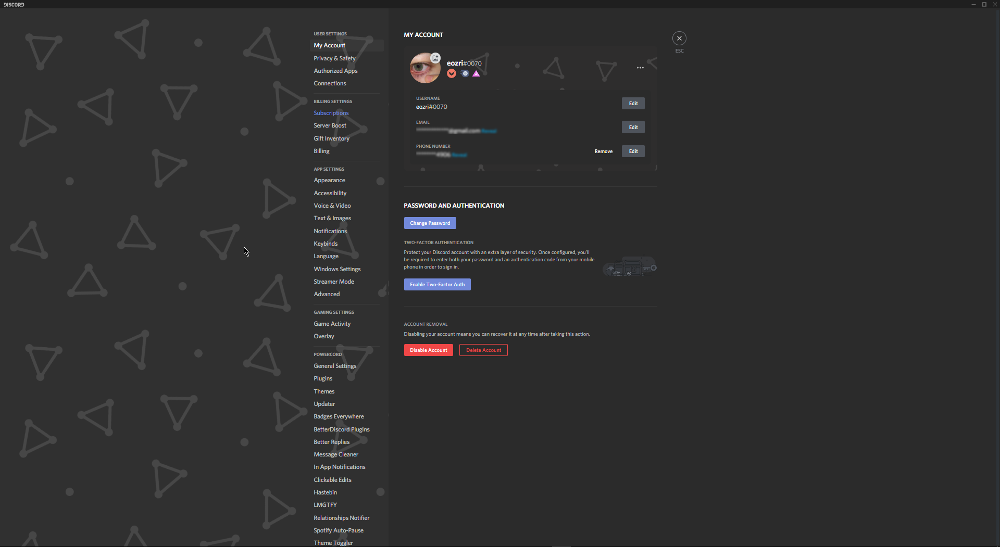

# updated as of 4/11/2021

# power-cord-theme
just a simple power cord theme yall can use since a bunch of yall asked for it. should work for BD too


# Installtion
open ur cmd prompt
step 1
```
cd powercord/src/Powercord/themes
```
step 2
```
git clone https://github.com/pix0070/power-cord-theme
```

# what it looks like




